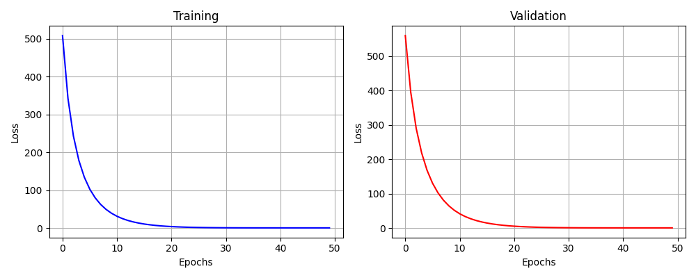
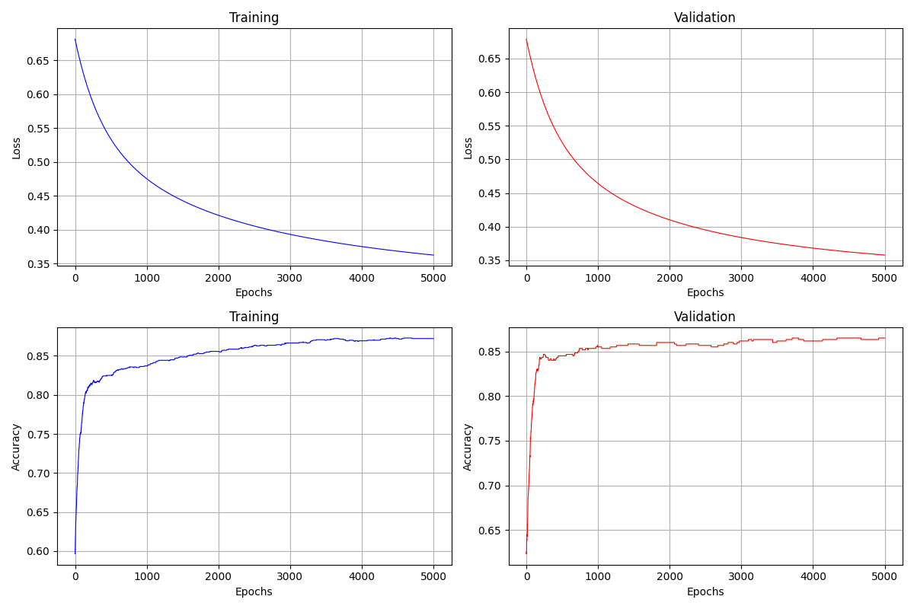

# NN-Implementation

This repository conntains from-scratch implementations of Machine Learning Models.

Currently, The models implemented are:
- Linear Regression
- Logistic Regression
- Single Hidden Layer Neural Network

## Access
The models can be accessed as:

```python
from models.Linear_Regression import LinearRegressor
from models.Logistic_Regression import LogisticRegressor
from models.Neural_Network import Single_Layer_NN
```

## Training on Synthetic Data
Using data from:
```python
from sklearn.datasets import make_regression
```
The Linear Regressor fitted as:


Using data from:
```python
from sklearn.datasets import make_classification
```
The Logistic Regressor fitted as:



