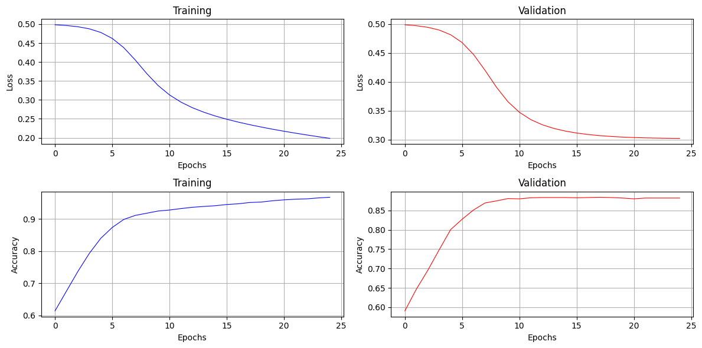

# NN-Implementation

These are some from-scratch implementations of Machine Learning Models done while practicing.

Currently, The models implemented are:
- Linear Regression
- Logistic Regression
- Single Hidden Layer Neural Network

## Training on Synthetic Data
Using data from:
```python
from sklearn.datasets import make_regression
```
The Linear Regressor fitted as:


Using data from:
```python
from sklearn.datasets import make_classification
```

The Logistic Regressor fitted as:


---

The Single Layer Neural Network fitted as:



